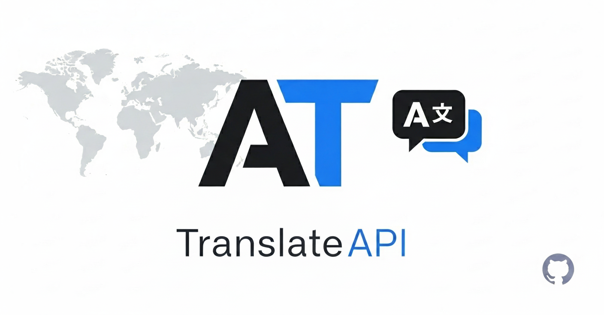

# API Translate



REST API construída com Spring Boot 3 que integra com o AWS Bedrock Runtime para realizar traduções. Este documento explica como gerar uma build nativa com GraalVM e como empacotar o binário em uma imagem Docker minimalista.

## Pré-requisitos

- JDK 21 (por exemplo, a distribuição GraalVM ou Liberica Native Image Kit) disponível em `JAVA_HOME`.
- Ferramentas nativas (GNU build tools) configuradas conforme a documentação do GraalVM para seu sistema operacional.
- Docker instalado caso deseje gerar a imagem containerizada.

## Executando em modo JVM

```bash
./mvnw spring-boot:run
```

## Gerando uma imagem nativa com GraalVM

1. Garanta que está usando um JDK compatível com native-image (GraalVM ou distribuição equivalente).
2. Execute o build nativo:

   ```bash
   ./mvnw -Pnative -DskipTests native:compile
   ```

   O binário será gerado em `target/translate`.

3. Rode o executável diretamente:

   ```bash
   ./target/translate
   ```

   O servidor será iniciado na porta `8080` por padrão.

## Construindo uma imagem Docker com o binário nativo

Após gerar o binário nativo (passo anterior), utilize o `Dockerfile.native` incluso no projeto:

```bash
docker build -f Dockerfile.native -t translate-native .
```

Para executar o container:

```bash
docker run --rm -p 8080:8080 translate-native
```

Isso iniciará o binário nativo dentro de uma imagem Debian slim com um usuário não privilegiado.


## Gerando relatório de teste
```bash
./mvnw test jacoco:report
```